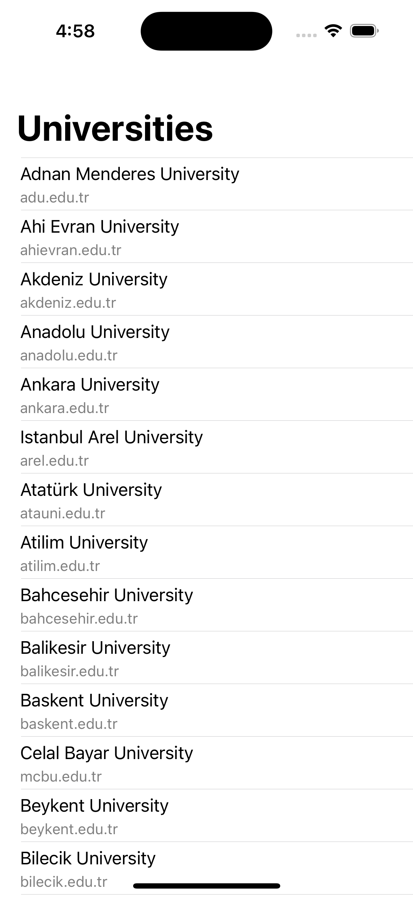

# Basics of MVVM

This application has been created to demonstrate how MVVM can be implemented in a simple way.

> This project has been created with guidance from the [tutorial](https://www.udemy.com/course/swift-5-ios-16-mvvm-detail-course-no-storyboard-free/) provided here.

## Screen

## Issues

Feel free to create an issue in our repository for any problems, questions, or feedback you have.

## Contributing

We welcome contributions, new features, improvements, and feedback.

Please fork the repository, make your changes, and submit a pull request for consideration.
